# Polyphonic Synthesizer for Teensy 4.1 

### Abstract
This project is an advanced realization of bachelor's project at Brno Univesity of Technology. 
It creates a digital synthesizer using a microcontroller development board, encompassing code development and a prototype build (including PCBs).
The C++ code has been made in VS Code using PlatformIO and it utilises Teensy Audio Library. 
The scripts that generate wavetables (as a header file) have been made using Python.
Those header files have been further edited in order to lower the amount of anti-aliasing using a MATLAB script. 

[**Video demonstration of the Synthesizer**](https://youtu.be/89R-V2SBuqk)

## Synthesis controls

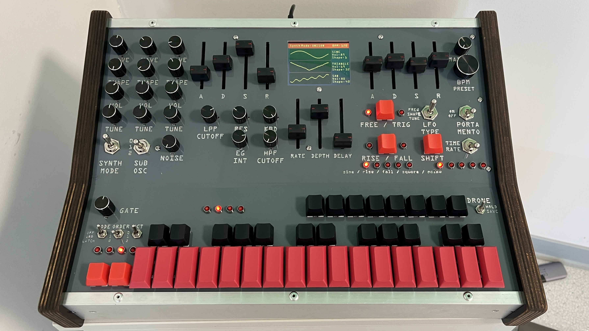

### Oscillators
The synthesizer features both Poly and Unison voice allocation modes. Sound generation relies on wavetables categorized into 6 distinct families: Saw, Square (featuring Pulse Width Modulation), Triangle, Sine, Instrument, and Voice. Users can select the waveform type using the `Wave` control and seamlessly interpolate between variations using the `Shape` parameter. In Poly mode, each note gets its own independent audio chain, while Unison mode stacks three parallel oscillators per note for a thicker sound. Additionally, a sub-oscillator can be introduced, transposing the primary frequency one or two octaves down.

### Filters
The signal chain utilizes two main filters. The primary is a 24 dB/oct resonant Low-Pass Filter based on the Huovilainen New Moog mathematical model, which is capable of self-oscillation. This is followed in series by a 12 dB/oct High-Pass Filter based on the State Variable Filter model. The Low-Pass Filter also includes a dedicated Keyboard Tracking feature, allowing the cutoff frequency to scale dynamically with the pitch of the note played.

### Envelopes
Each voice is equipped with two dedicated ADSR (Attack, Decay, Sustain, Release) envelopes, allowing stages up to 3 seconds in length. One envelope shapes the final amplitude of the signal, while the other modulates the Low-Pass Filter's cutoff frequency. The filter envelope also features an `Intensity` control, enabling users to finely scale or invert the depth of the modulation.

### LFO
The Low-Frequency Oscillator can modulate the LPF Cutoff, Oscillator Shape, and Voice Pitch (Detune). It features four operational modes: `Free` (a single global LFO for all voices), `Retrig` (independent LFO per voice), and `Rise` or `Fall` (one-shot linear modulations triggered per note). Available waveforms include Sine, Saw Rise, Saw Fall, Square, and a randomized Noise sample. Users can adjust the modulation `Rate` (0.1–25 Hz), `Depth`, and a fade-in `Delay` of up to 3 seconds.

### Portamento
Available exclusively in Unison mode, Portamento introduces a smooth glide between overlapping notes. Its speed is synchronized to the global BPM and can be operated in two modes: `Time`, where the glide duration is a fixed note division regardless of the pitch distance, and `Rate`, where the glide duration scales with the interval, defined by the time it takes to travel one octave.

### Sequencer
A built-in step sequencer synchronizes to the global BPM and features two main performance modes. `Arp` mode functions as a traditional arpeggiator playing held notes in sequence, whereas `Latch` mode captures pressed keys into a buffer and plays them continuously without requiring the keys to be held. The sequence playback can be customized with order settings (Up, Down, As Played), octave duplications (+1 or +2 octaves), and an adjustable `Gate` parameter defining the note length (1–100%) per step. There's also an option to adjust the each individual step length via secret settings.

### Drone
This alternative ambient mode leverages 10 additional parallel oscillator chains utilizing simplified SVF filters, split into two alternating groups (A and B), alongside independent noise generators. Using the `Save` mode, users can capture the exact parameter settings of currently active voices and store them to one of 8 dedicated buttons. Switching to `Hold` mode allows users to endlessly play back these captured static drones concurrently with the standard synthesis engine.

## List of hardware components

* Teensy 4.1 Development board

* Audio Adaptor Board for Teensy (Rev D)

* 16-Channel Analog/Digital Multiplexer/Demultiplexer, CD74HC4067
  - used for various parameter configuration via potentiometers and toggle switches
  - 3 modules used in total 

  ### Mux 1 Channels:
  | Mux Channel | Parameter name | Connected Component |
  | :--- | :--- | :--- |
  | C0 | **Wave 1** | **Potentiometer** |
  | C1 | **Wave 2** | **Potentiometer** |
  | C2 | **Wave 3** | **Potentiometer** |
  | C3 | **Shape 1** | **Potentiometer** |
  | C4 | **Shape 2** | **Potentiometer** |
  | C5 | **Shape 3** | **Potentiometer** |
  | C6 | **Volume 1** | **Potentiometer** |
  | C7 | **Volume 2** | **Potentiometer** |
  | C8 | **Volume 3** | **Potentiometer** |
  | C9 | **Tune 1** | **Potentiometer** |
  | C10 | **Tune 2** | **Potentiometer** |
  | C11 | **Tune 3** | **Potentiometer** |
  | C12 | **Pink Noise** | **Potentiometer** |
  | C13 | **SynthMode - Poly** | **2-way Toggle Switch** |
  | C14 | **Sub-OSC - OFF** | **3-way Toggle Switch** |
  | C15 | **Sub-OSC - +2 octaves** | **3-way Toggle Switch** |

  ### Mux 2 Channels:
  | Mux Channel | Parameter name | Connected Component |
  | :--- | :--- | :--- |
  | C0 | **LPF Cutoff** | **Potentiometer** |
  | C1 | **LPF Resonance** | **Potentiometer** |
  | C2 | **Keyboard Tracking** | **Potentiometer** |
  | C3 | **Filter Envelope Intensity** | **Potentiometer** |
  | C4 | **HPF Cutoff** | **Potentiometer** |
  | C5 | **Filter Attack** | **Potentiometer** |
  | C6 | **Filter Decay** | **Potentiometer** |
  | C7 | **Filter Sustain** | **Potentiometer** |
  | C8 | **Filter Release** | **Potentiometer** |
  | C9 | **LFO Rate** | **Potentiometer** |
  | C10 | **LFO Depth** | **Potentiometer** |
  | C11 | **LFO Delay** | **Potentiometer** |
  | C12 | **Amplitude Attack** | **Potentiometer** |
  | C13 | **Amplitude Decay** | **Potentiometer** |
  | C14 | **Amplitude Sustain** | **Potentiometer** |
  | C15 | **Amplitude Release** | **Potentiometer** |

  ### Mux 3 Channels:
  | Mux Channel | Parameter name | Connected Component |
  | :--- | :--- | :--- |
  | C0 | **Master Volume** | **Potentiometer** |
  | C1 | **Sequencer Gate** | **Potentiometer** |
  | C2 | **LFO Type - Frequency** | **3-way Toggle Switch** |
  | C3 | **LFO Type - Tune** | **3-way Toggle Switch** |
  | C4 | **Portamento - ON** | **2-way Toggle Switch** |
  | C5 | **Portamento - Mode** | **2-way Toggle Switch** |
  | C6 | **Drone - mode** | **2-way Toggle Switch** |
  | C7 | **Sequencer Mode - OFF** | **3-way Toggle Switch** |
  | C8 | **Sequencer Mode - Latch** | **3-way Toggle Switch** |
  | C9 | **Sequencer Order - Up** | **3-way Toggle Switch** |
  | C10 | **Sequencer Order - Queue** | **3-way Toggle Switch** |
  | C11 | **Sequencer Octaves - 0** | **3-way Toggle Switch** |
  | C12 | **Sequencer Octaves - 2** | **3-way Toggle Switch** |

* 8-bit I/O Expander I2C-Bus, PCF8574T
  - used for LED signals for parameter state identification 
  - 2 modules used in total 

  ### I/O Expander 1 Pinout:
  | I/O Expander Pin | Parameter name |
  | :--- | :--- |
  | P0 | **LFO Mode #1** |
  | P1 | **LFO Mode #2** |
  | P2 | **LFO Mode #3** |
  | P3 | **LFO Mode #4** |
  | P4 | **LFO Wave #1** |
  | P5 | **LFO Wave #2** |
  | P6 | **LFO Wave #3** |
  | P7 | **LFO Wave #4** |

  ### I/O Expander 2 Pinout:
  | I/O Expander Pin | Parameter name |
  | :--- | :--- |
  | P0 | **Sequencer Rate #3** |
  | P1 | **Sequencer Rate #4** |
  | P2 | **LFO Wave #5** |
  | P3 | **Portamento Rate #1** |
  | P4 | **Portamento Rate #2** |
  | P5 | **Portamento Rate #3** |
  | P6 | **Portamento Rate #4** |
  | P7 | **Portamento Rate #5** |

* 3.2" 240x320 TFT display, ILI9341
  - SPI Display used for wavetable state reading

* Potentiometers
  - 20 Rotary B5K (WH148)
  - 11 Slider B10K (60mm)

* Rotary Encoder, KY-040
  - used for BPM configuration
  - button is used for preset selection

* Keyboard switches, MX linear Red
  - set up as a matrix to preserve pins

  

* Toggle switches
- 3× KN3 2-way toggle switch
- 2× KN3 3-way toggle switch
- 1× MTS-102 2-way toggle switch
- 3× MTS-103 3-way toggle switch

* Basic electronic components
- Resistors
  - 1× 100 (for Display backlight)
  - 22× 1k (for LEDs)
  - 14× 10k (pull resistors)
- Capacitors
  - 5× Ceramic 100nF (for coupling)
- Diodes
  - 43× 1N4148 (for Keyboard switches)
- LEDs
  - 22× 3mm Red
- Terminal blocks
  - 45× 3-Pin 2.54mm
  - 6× 2-Pin 2.54mm

## Circuit & PCB schematics
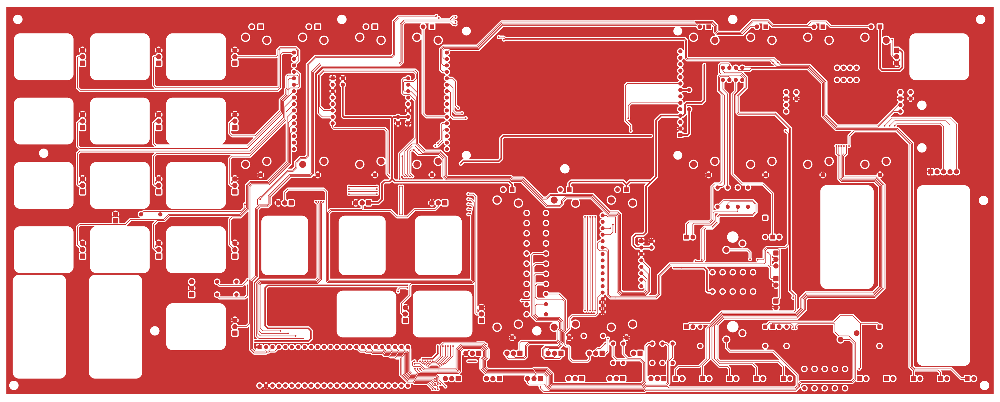
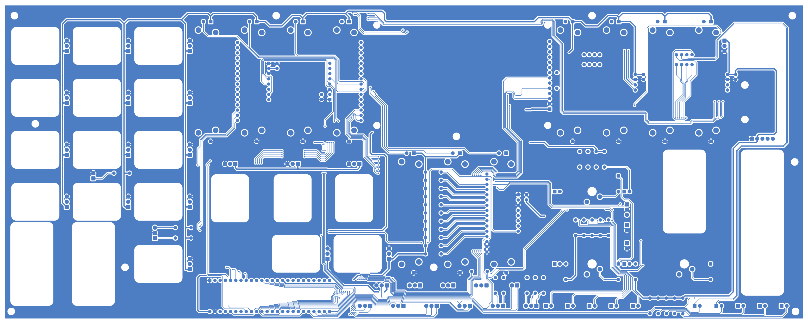
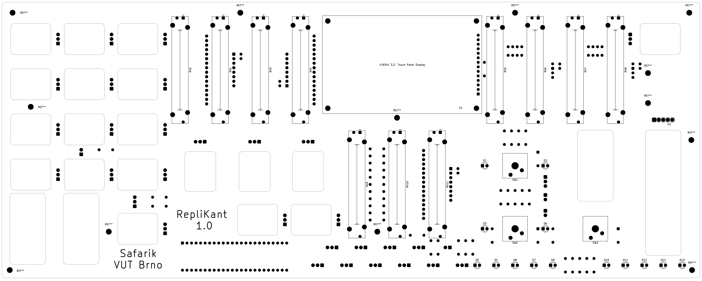
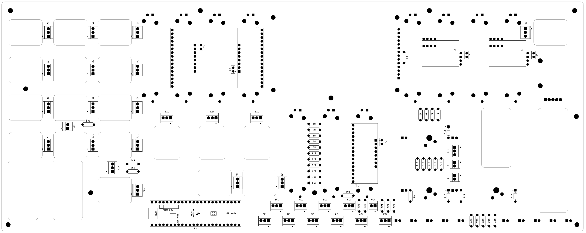
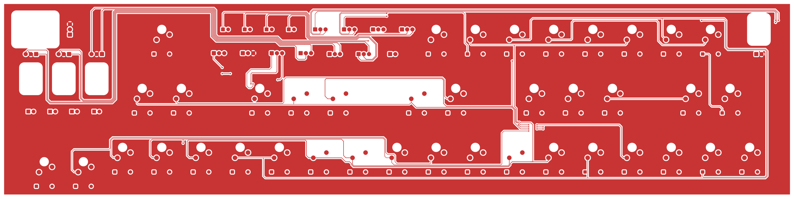
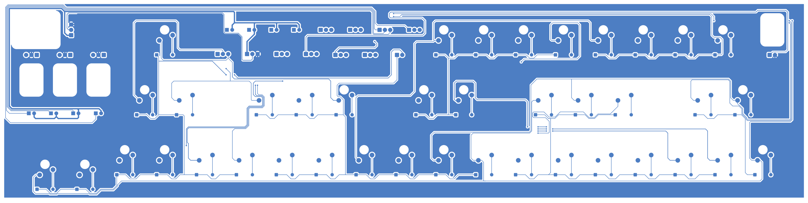
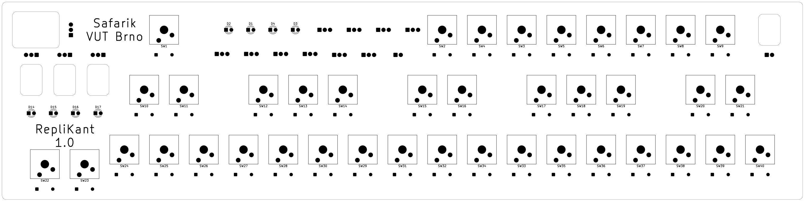
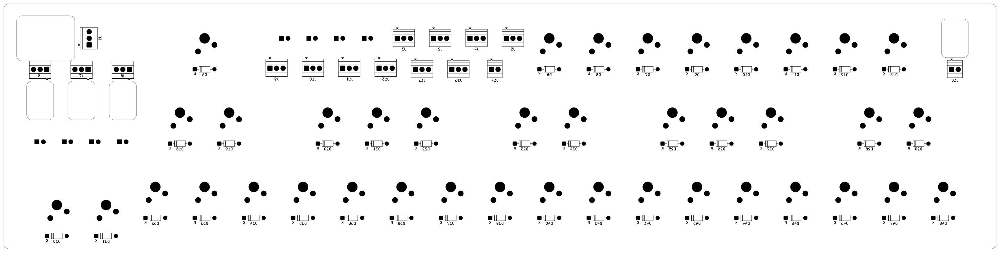

Circuit & PCB schematics have been made in KiCad 9.0 and the project is available [here.](./Design/KiCad)

## Pinout Configuration

| Teensy Pin | Pin name | Connected Components |
| :--- | :--- | :--- |
| 0 | **SW** | **Rotary Encoder** |
| 1 | **DT** | **Rotary Encoder** |
| 2 | **CLK** | **Rotary Encoder** |
| 3 | **S0** | **Mux #1, #2 and #3** |
| 4 | **S1** | **Mux #1, #2 and #3** |
| 5 | **S2** | **Mux #1, #2 and #3** |
| 6 | **S3** | **Mux #1, #2 and #3** |
| 7 | **DIN** | **Audioshield** |
| 8 | **DOUT** | **Audioshield** |
| 9 | **D/C** | **Display** |
| 10 | **CS** | **Display** |
| 11 | **SDI (MOSI)** | **Display** |
| 12 | **SDO (MISO)** | **Display** |
| 13 | **SCK** | **Display** |
| 14 | **Signal #1** | **LED #1 (Sequencer Rate #1)** |
| 15 | **Signal #2** | **LED #2 (Octave #4)** |
| 16 | **Signal #3** | **LED #3 (Octave #3)** |
| 17 | **Signal #4** | **LED #4 (Octave #2)** |
| 18 | **SDA** | **Audioshield** |
| 19 | **SCL** | **Audioshield** |
| 20 | **LRCLK** | **Audioshield** |
| 21 | **BCLK** | **Audioshield** |
| 22 | **Signal #5** | **LED #5 (Octave #1)** |
| 23 | **MCLK** | **Audioshield** |
| 24 | **Row #1** | **Keyboard** |
| 25 | **Row #2** | **Keyboard** |
| 26 | **Row #3** | **Keyboard** |
| 27 | **Row #4** | **Keyboard** |
| 28 | **Row #5** | **Keyboard** |
| 29 | **Row #6** | **Keyboard** |
| 30 | **Row #7** | **Keyboard** |
| 31 | **Row #8** | **Keyboard** |
| 32 | **Row #9** | **Keyboard** |
| 33 | **Column #1** | **Keyboard** |
| 34 | **Column #2** | **Keyboard** |
| 35 | **Column #3** | **Keyboard** |
| 36 | **Column #4** | **Keyboard** |
| 37 | **Column #5** | **Keyboard** |
| 38 | **Signal #6** | **LED #6 (Sequencer Rate #2)** |
| 39 | **Sig (A15)** | **Mux #1** |
| 40 | **Sig (A16)** | **Mux #2** |
| 41 | **Sig (A17)** | **Mux #3** |

### Images

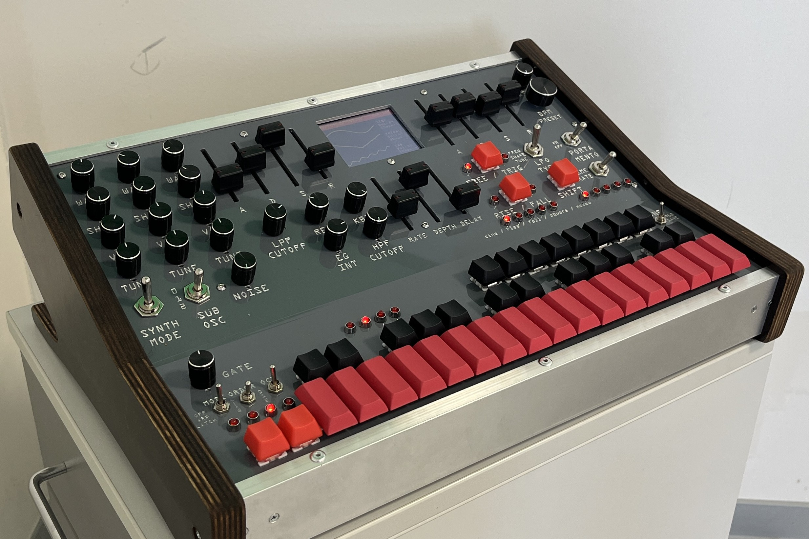
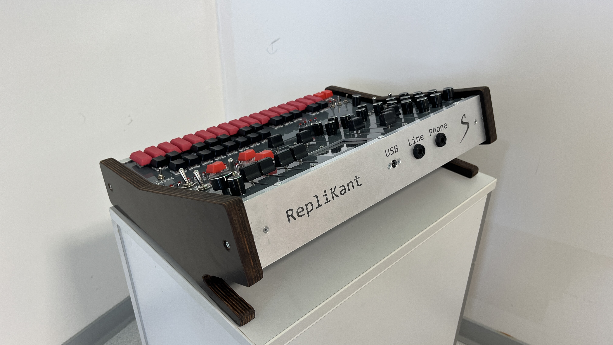
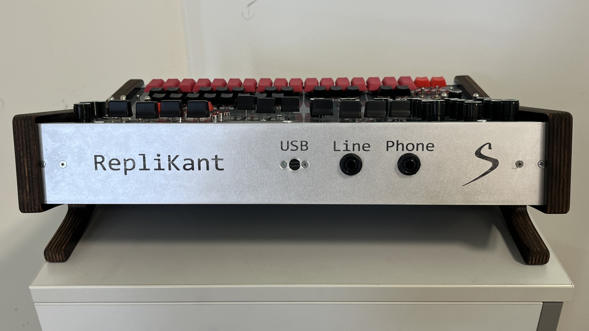

### 3D Model

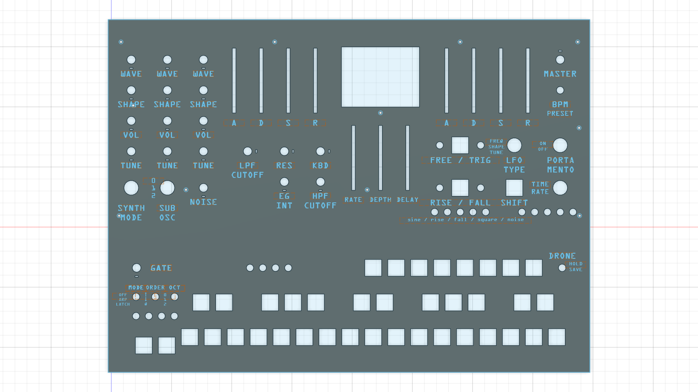

The 3D model has been made for laser engraving of the control panel. 

### Possible improvements

* The Line Out connector doesn't work now, and I don't know why, but I suppose it's not of mechanical nature.
* The GND is pretty noisy as of now, especially when powering via USB.
* Preset function isn't developed yet, but will be once I return to this project later.

## References

* Teensy 4.1 information: [link PJRC.com](https://www.pjrc.com/store/teensy41.html)
* Audio Adaptor Board for Teensy information: [link PJRC.com](https://www.pjrc.com/store/teensy3_audio.html)
* Incredible source of information and amazing YouTube content: [link notesandvolts.com](https://www.notesandvolts.com)
* I hereby acknowledge use of free-license AI tool for coding: [link gemini.google.com](https://gemini.google.com)